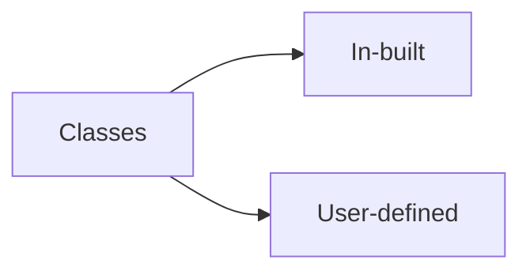

*27/02/23*

### Classes are of two types 



### Basic Program

- everything in Java is a class since Java is a fully object-oriented language

```java
class HelloWorld {
    public static void main(String[] args) {
        System.out.println("Hello World!");
    }
}
```


- String[] means that the main method takes an array of strings as an argument